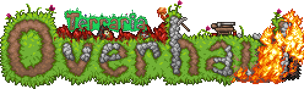

# What's this?
Terraria Overhaul is a *huuuge* game mechanics changing mod for Terraria.
You can read more about it at [this forum page](https://forums.terraria.org/index.php?threads/.60369/) (Might be outdated.)

# What's the state of the rebuild?
This version is around 50% done.
It's missing many features from the 1.3 version, but what's currently implemented is much superior to the old version.
Here's a (always incomplete) summary of the implemented features/changes:
- Movement:
	- Physics changes.
	- New & improved dodgerolls.
	- Grappling hook swinging physics.
	- Climbing.
	- Bunnyhopping.
	- Walljumps and wallrolls.
	- Players facing the mouse cursor.
	- Jump key buffering & auto-jump.
- New & improved melee combat:
	- New satisfying sound effects, screenshakes, all the wonderful things.
	- New air combat - take the fight into the sky with repeated hits.
	- Charged attacks.
	- Killing Blows for broadswords.
- Gun combat:
	- New satisfying sound effects, muzzleflashes, screenshakes, visual recoil, all the wonderful things.
	- New alt fires for some weapon types (soon most); if weapons don't have their own.
	- Non-visual-only reloading removed forever.
- Magic combat:
	- New satisfying sound effects, screenshakes, visual recoil, all the wonderful things.
	- Charged shots.
	- New mana gameplay loops - rebalanced regeneration, drops of mana from enemies.
- New & improved blood & gore.
	- Heavily improved decals.
	- Gore interactivity.
- Ambience:
	- Ambient sound loops.
	- Heavily improved reverb & low-pass filtering effects.
		- No longer exclusive to unofficial TML forks.
		- Now dynamic, with even outside sounds sounding muted in doors.
	- New footstep sounds.
- Camera improvements.
- Velocity-based rotation for players.
- Random removal:
	- Damage randomization removal.
- Improved & even more dynamic crosshair.

They still, however, make a big impact on the game's feel.

# How do I build this?

### For people who know what they're doing:
With the '[1.4_mergedtesting](https://github.com/tModLoader/tModLoader/tree/1.4_mergedtesting)' branch of tModLoader.

### For people who don't know what they're doing:
Below is a step by step instruction for that. It only assumes that you know at least how to use cmd. You should.

**Getting the right tModLoader:**
- You need Windows to build it.
- Install [Visual Studio 2022 Community](https://visualstudio.microsoft.com/thank-you-downloading-visual-studio/?sku=Community&channel=Release&version=VS2022) (It's free.)
During installation, check the `.NET desktop development` workload
- Install Git if you don't have it - [Git For Windows](https://git-scm.com/download/win).
- Ensure that you have .NET 6.0.1+ SDKs.
- Clone the 1.4_mergedtesting branch - `git clone https://github.com/tModLoader/tModLoader -b 1.4_mergedtesting`.
- Run setup.bat and click Setup, pointing the tool to your latest vanilla terraria .exe.
- Run `solutions/buildRelease.bat`. This will build 1.4 tML into a 'tModLoaderDev' directory, find it next to Terraria's and use 'start-tModLoader.bat' to launch it.

**Compiling the mod:**
- Clone the mod's 1.4 branch into `%userprofile%/Documents/My games/Terraria/ModLoader/Beta/Mod Sources`. Note the Beta directory.
The git command for that would be `git clone https://github.com/Mirsario/TerrariaOverhaul -b 1.4`.
- Head over to Mod Sources in-game and `Build & Reload` TerrariaOverhaul.

That's all. Use `git fetch` and `git pull` to keep up with updates. Note that you'll need to rerun patching in the tML setup tool when updating tML.

## License
All code of this repository is provided under [the MIT License](https://github.com/Mirsario/TerrariaOverhaul/blob/1.4/LICENSE.md).

All of the art, audio, and other non-code assets belong to their respective owners and are used non-commercially either with a permission, a royalty-free license, or with various modifications & trust in the holiness of videogame modding.
No copyright infringements intended.

Besides for that, I only want to say - be nice, and please [contribute configuration](https://github.com/Mirsario/TerrariaOverhaul/issues/41) instead of splitting the mod's features into other mods. The latter is dickish.
